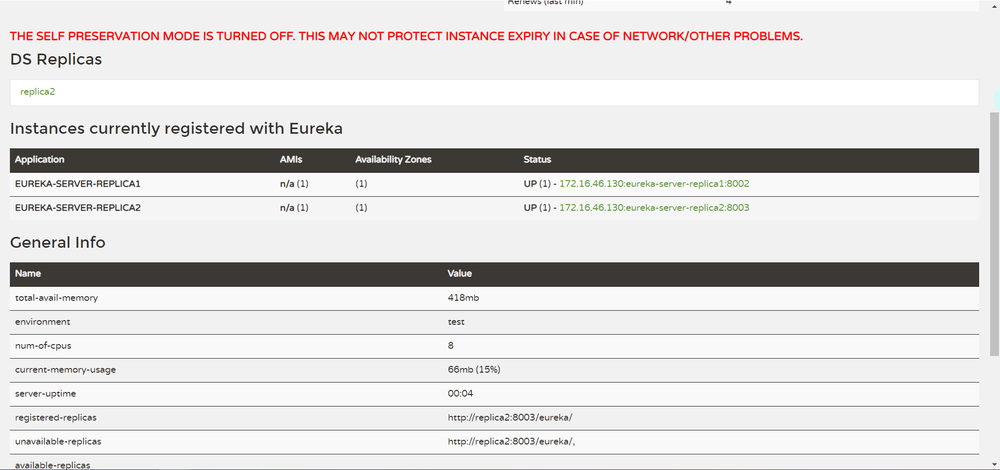
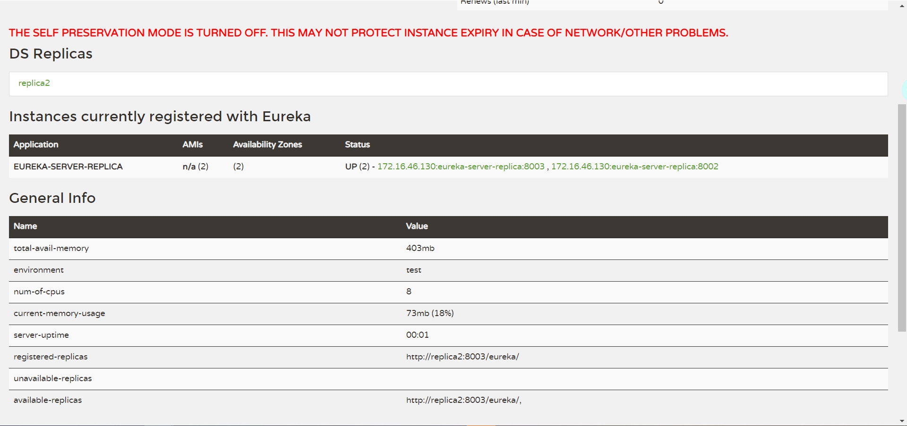

##eureka-server搭建双注册中心时
1、当eureka-server-replica1服务启动时设置当前服务的Application-Name为eureka-server-replica1，
且eureka-server-replica2服务启动时设置当前服务的Application-Name为eureka-server-replica2时，此时
虽然两个服务的节点serviceUrl：defaultZone是互相注册的关系，但是体现在Eureka的注册面板上，则是这样的效果

2、但是当设置两个eureka双节点的服务Application-Name为相同的实例名称时，则显示结果如下图所示：

对比上下两图可以看到设置为相同的Application-Name时，General info下所展示的信息为 unavailable-replicas不可使用的，而当设置为相同的Application-Name时，则是available-replicas
，究其原因则是：

可参考链接：

http://www.ityouknow.com/springcloud/2017/05/10/springcloud-eureka.html

https://juejin.im/post/5d78cd53f265da03d55e8351

https://www.fangzhipeng.com/springcloud/2018/08/01/sc-f1-eureka.html