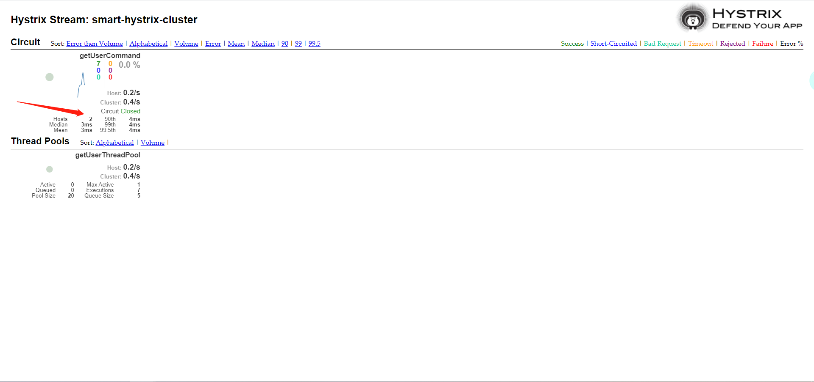

# smart-hystrix-dashboard
Hystrix提供了Hystrix Dashboard来实时监控HystrixCommand方法的执行情况。 
Hystrix Dashboard可以有效地反映出每个Hystrix实例的运行情况，帮助我们快速发现系统中的问题，
从而采取对应措施。

## 介绍
Hystrix监控对应的HystrixCommand方法的执行情况，一般分为两种情况，分别是监听单Hystrix服务实例执行情况 和 多Hystrix服务集群的实例执行情况

访问：http://localhost:8103/hystrix 后进入如下页面，此处分别说明了单Hystrix服务实例于多Hystrix集群时所对应的URL格式

此时配置单Hystrix如下

图表解读如下，需要注意的是，小球代表该实例健康状态及流量情况，颜色越显眼，表示实例越不健康，小球越大，表示实例流量越大。曲线表示Hystrix实例的实时流量变化。

## 多Hystrix服务集群监控

配置多Hystrix服务集群时，此处则新增了一个新的服务smart-hystrix-turbine；通过引入turbine jar，使其聚合对应的hystrix-service服务的监控信息，
然后再对应的Hystrix-Dashboard监控面板中，配置对应的 turbine服务地址的方式，以此获取所对应的Hystrix服务集群的监控信息；

多个Hystrix-Service的监控信息 --> 聚合至对应的 Turbine服务中  --> 然后再给到Hystrix-Dashboard服务进行集群监控信息的展示

如下图所示：

## 额外的操作
除了上述所介绍的之外，此处还新增了smart-hystrix-user的application-replica1.yml配置文件，目的是为了直接一次性启动两个hystrix-user的服务实例，
以此来尝试多集群时的Hystrix-dashboard的监控方式；除此之外，对于单实例的Hystrix服务的监控方式，实际上也是需要暴露hystrix的监控断点的，详情可
查看smart-hystrix-user的application.yml配置；而对于监控多Hystrix集群实例的Turbine服务配置，则可以参考 smart-hystrix-turbine服务配置；

可参考链接：

https://juejin.im/post/5d88cb58f265da03e4679eff

https://www.cnblogs.com/x1mercy/p/9291348.html