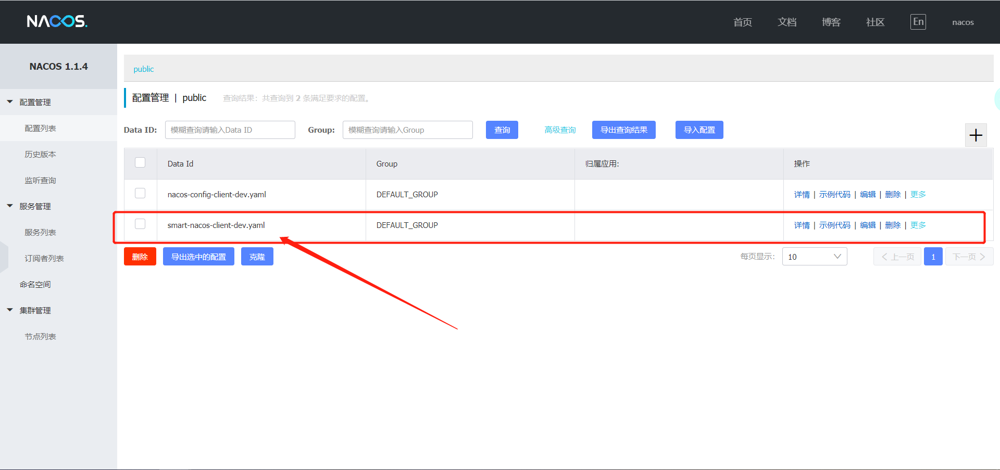

# smart-nacos-client
smart-nacos-client 实现基于Nacos的服务配置管理及配置自动更新功能；

## bootstrap.yml说明
首先先说明一下bootstrap.yml于application.yml的区别：

bootstrap.yml（bootstrap.properties）用来在程序引导时执行，应用于更加早期配置信息读取;

application.yml（application.properties) 应用程序特有配置信息，可以用来配置后续各个模块中需使用的公共参数等。

汇总：bootstrap.yml在服务启动时的加载时机是优先于application.yml的加载

**由于此处Nacos是作为配置中心管理的方式而存在，所以对于Nacos的配置中心的功能进行配置时都应该配置到对应的bootstrap.yml中**

## 配置管理
关于Nacos的使用介绍看这里--->[点击我](../../smart-nacos)

Nacos中针对smart-nacos-client中增加如下配置：arnold:zhao:zzh

如上界面中，dataId的定义格式如下：
~~~
${prefix}-${spring.profile.active}.${file-extension}
~~~
* prefix 默认为 spring.application.name 的值，也可以通过配置项 spring.cloud.nacos.config.prefix来配置。
* spring.profile.active 即为当前环境对应的 profile， 注意：当 spring.profile.active 为空时，对应的连接符 - 也将不存在，dataId 的拼接格式变成 ${prefix}.${file-extension}
* file-exetension 为配置内容的数据格式，可以通过配置项 spring.cloud.nacos.config.file-extension 来配置。目前只支持 properties 和 yaml 类型。

此时配置保存后，启动当前 smart-nacos-client项目，并访问该链接：http://localhost:9101/configInfo，返回结果便是“cyx”，
重复在Nacos中编辑对应的配置后，重新访问http://localhost:9101/configInfo，则每次读取的结果都是最新的Nacos配置结果

**注意**
* 正是由于Nacos配置管理的相关配置是在bootstrap.yml中配置的，所以项目的启动过程中，便可以将当前对应的Nacos中所存储的配置信息直接读取到项目当中；
才可以避免ConfigClientController中serverName属性@Value取值异常的问题，否则@Value启动时会由于读取不到对应的配置信息，而抛出异常；

~~~
nested exception is java.lang.IllegalArgumentException: Could not resolve placeholder 'arnold.zhao' in value "${arnold.zhao}"
~~~

* 为了避免Nacos中没有新增相关配置而导致服务异常的问题出现，一般情况下对于Nacos中的配置，都可以在对应的application-dev.yml中进行默认配置，以此避免Nacos中配置丢失而导致的服务异常问题；
（项目中可以放置一个单独的application-configure.yml用于集中管理动态的配置信息，且方便Nacos批量导入时使用）

## 参考链接：
[关于bootstrap的详细加载说明可点击我查看](https://www.cnblogs.com/BlogNetSpace/p/8469033.html)
